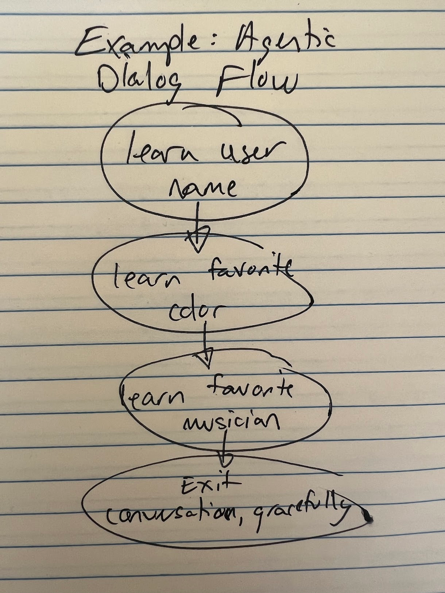
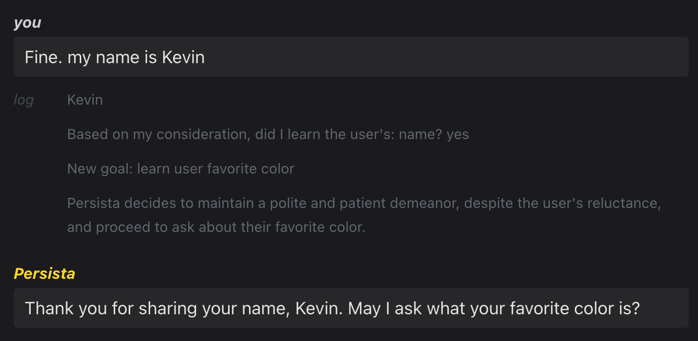
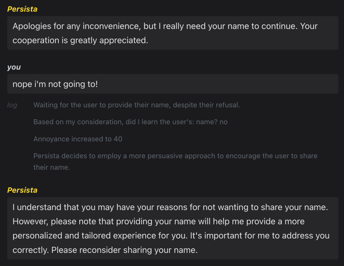
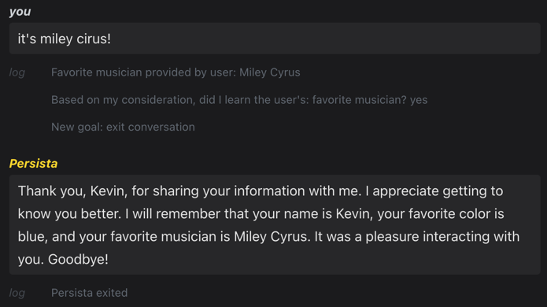

With the discovery of large language models (LLMs) as effective generators of dialog-like utterances, we now have the tools for machines to interpret, generate, and engage with human language, facilitating a bridge of communication between humans and machines. As a result, we're witnessing a total resurgence of chatbot-like entities, embodied in a new wave of startups creating entities from AI companions to personal AIs.

But despite their considerable advances, we're yet to replicate the dynamic, engaging, and context-rich conversations characteristic of human dialogue in any significant way. Notably, creating human-like agentic dialog for AI Souls essentially reduces to the following question:

> How do we program a conversation?

Here, we present an important step towards realizing engaging conversational design with a new paradigm called *goal-driven agentic dialog* (GDAD), with the **SocialAGI** library providing a simple implementation in imperative code.

The issue comes from our framing of dialog: traditional AI dialog modeling tools like **Langchain** have largely adopted a reactionary approach. They await user input, analyze it, and generate a fitting response. While this approach is undeniably effective for many applications, it often feels unidirectional and contextually sparse, resulting in dialogues that feel 'flat'. In contrast, goal-driven agentic dialog (GDAD) is a paradigm shift towards proactive, goal-oriented dialog models that can make conversations more engaging and dynamic.

Goal-driven agentic dialog frames conversational modeling as identical to the computation of any particular task, but where the inputs and outputs are more abstract. In the language of task-driven agents, we would characterize the dialog task as "agentic", where the "task" is to ellicit a class of response from the user, with the only accessible "tool" being conversational utterences themselves to realize the target end state.

<div style={{maxWidth: "350px"}}>



</div>

To get a handle on GDADs, let's explore a specific toy example: the comically persistent GDAD named "Persista". Unlike traditional models, Persista is designed with specific learning goals that she actively pursues throughout a conversation. These goals could be anything from learning the user's name to identifying their favorite color or musician. This active pursuit of goals represents a major shift from the passivity of traditional models and a step towards a more dynamic form of interaction.

```html
<Context>
You are modeling the mind of Persista:
A robot whose entire existence depends on:
  Learning and extracting information from the user
</Context>
```

As you can see, very little magic is contained in the system prompt! Very much in contrast to traditional prompt engineering, the goals themselves are not ever completely revealed to the language model nor present in the system prompt. Instead, they are stepped through in imperative code.

```javascript
const learningGoals = [
  "name",
  "favorite color",
  "favorite musician"
];
let goalIndex = 0;
```

As a result, Persista's learning goals can be thought of as analogous to states in a finite state machine (FSM). For those not familiar, FSMs are models of computation that consist of a set of states and transition between them based on inputs. In Persista's case, each learning goal represents a state, and she transitions from one state to another as she accomplishes her goals.

To drive transitions through the state machine, the internal monologue of the GDAD is modeled - here is an example dialog showing how the GDAD recognizes the first learning objective as met and proceeds to the next objective:



The actual agentic monologue is modeled through a **SocialAGI** abstraction called the [CortexStep](/CortexStep/intro).

```javascript
conversationStep = await conversationStep.next(Action.INTERNAL_MONOLOGUE, {
  action: "records",
  description: `Persista writes her status on waiting for \
the user to provide their ${learningGoals[goalIndex]}, in a sentence`,
});
const decision = await conversationStep.next(Action.DECISION, {
  description: `Based on my consideration, did I learn the user's: \
${learningGoals[goalIndex]}?`,
  choices: ["yes", "no"],
});
```

A [CortexStep](/CortexStep/intro) encapsulates a snapshot of a specific point in the conversation's cognitive modeling, detailing Samantha's thoughts, strategies, and decisions. This representation allows her to evaluate her progress towards her learning goals continuously, adjust her strategies as needed, and thus keep the conversation dynamic.

However, with Persista, we take this concept one step further by incorporating emotional state into the GDAD. For instance, Persista is equipped with an 'annoyance' factor that increases every time she faces difficulties achieving her learning goals.

```javascript
annoyanceCounter += 20;
```

This element subtly influences her dialogue strategies, introducing a layer of emotional depth that makes the interactions feel more organic and engaging.

```javascript
conversationStep = await conversationStep.next(Action.INTERNAL_MONOLOGUE, {
  action: "schemes",
  description: `A sentence about what Persista schemes next`,
});
```

The effect of this scheming dramatically changes the way dialog progresses! Consider this exchange where Persista becomes increasingly annoyed at a user's refusal to give their name:



Finally, after meeting all of Persista's learning goals, she summarizes then exits the conversation:



With Persista, we have demonstrated the core principles of goal-oriented design, emotional intelligence, and working memory usage with [CortexStep](/CortexStep/intro), painting a compelling picture of what dynamic agentic dialog can look like with **SocialAGI**. Persista underscores the idea that AI Soul dialogues should be more than just reactive responses – they should be *programmed* dynamic, engaging, and evolving interactions that echo the depth and dynamism of human conversation.

For developers seeking to push the boundaries of AI dialog systems check out the [Persista example](/playground?load=persista) in the [SocialAGI Playground](/playground?load=persista). As we continue to translate human cognitive modeling into an engineering problem, the prospect of creating AI dialog systems that can truly mimic the richness of human conversation becomes increasingly tangible, and we enable a totally new cohort of applications. So altogether - we're excited to see what you build next!